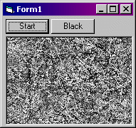



## Watch the wiggly worms\!

### Description

Possibly *the* most useless program ever, but on full screen, watch the worms travel their random path around the screen to build a totally strange texture. It's really quite hypnotic.

Ideas:

- In a banner ratio, it makes a good moving background

- Make the worms black to clear the screen

- Would make a super screen saver

- Ideal for creating textures (using gausian/motion blur)

Feel free to change this to your liking.

Please comment on what you do with this.
 
### More Info
 
Change lNumParticles for the number of particles on screen

looks very different with a different draw width

             |
---                |---
**Submitted On**   |2002-07-23 16:20:54
**By**             |[Qucami](https://github.com/Planet-Source-Code/PSCIndex/blob/master/ByAuthor/qucami.md)
**Level**          |Beginner
**User Rating**    |4.0 (12 globes from 3 users)
**Compatibility**  |VB 4\.0 \(32\-bit\), VB 5\.0, VB 6\.0
**Category**       |[Graphics](https://github.com/Planet-Source-Code/PSCIndex/blob/master/ByCategory/graphics__1-46.md)
**World**          |[Visual Basic](https://github.com/Planet-Source-Code/PSCIndex/blob/master/ByWorld/visual-basic.md)
**Archive File**   |[Watch\_the\_1095877232002\.zip](https://github.com/Planet-Source-Code/qucami-watch-the-wiggly-worms__1-37189/archive/master.zip)

